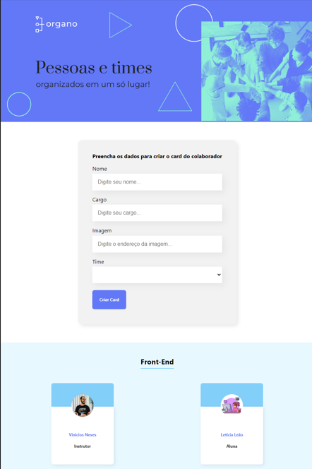

# Organo

## Projeto desenvolvido durante o curso de React da Alura com o professor Vinicios Neves. É só preencher os dados que a página vai criando cards da equipe com a descrição de função e código. 👩🏽‍💻

## [👉🏽Clique aqui para acessar a página](https://letsle.github.io/organo/)

